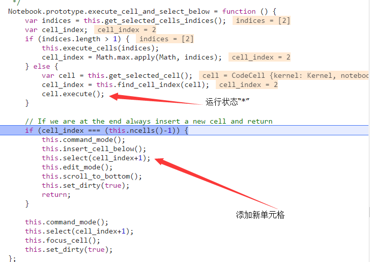
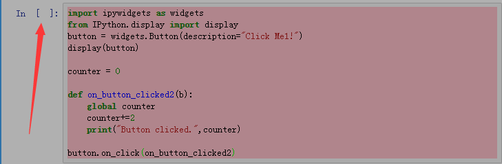
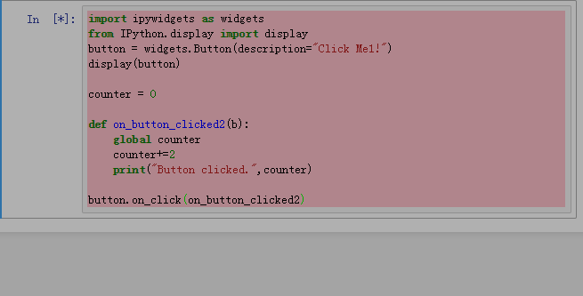
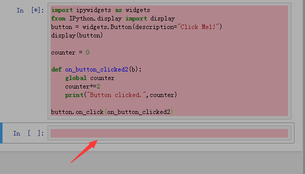
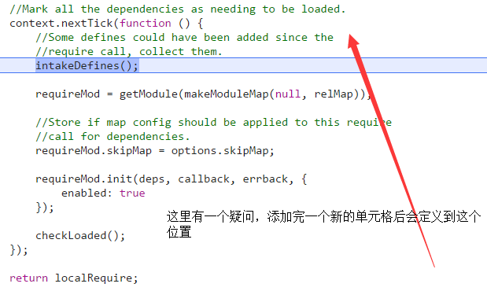
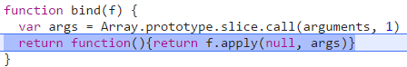
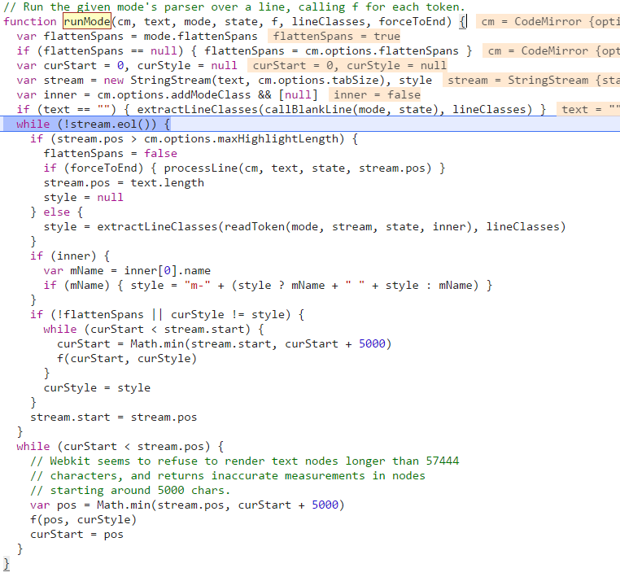
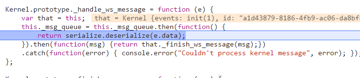
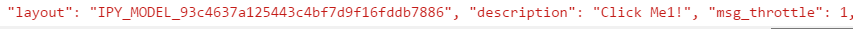
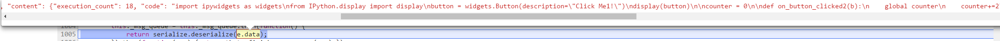

## 代码的运行过程

### 判断点击的是哪个按钮

获取当前按钮的属性名：data-jupyter-action  属性值：jupyter-notebook:run-cell-and-select-next 里面的run-cell-and-select-next来确定点击的按钮，actions.js-->'  （运行状态，添加新的单元格 见----》显示为运行状态，并添加新的单元格 下面的图

run-cell-and-select-next': {

            handler : function (env) {
                env.notebook.execute_cell_and_select_below();
                //调用notebook.js里面的execute_cell_and_select_below()这个函数是运行选定的模块
            }
        }


### 显示为运行状态,并添加新的单元格

execute_cell_and_select_below()-->cell.execute()//(这里会调用codecell.js里面的execute。)  -->set_input_prompt()//调用codecell.js里面的set_input_prompt()
设置它的运行状态



input_prompt_classical() //<bdi>In</bdi>&nbsp;[ * ]:

添加新的单元格


### 采用轮询的方式读取输入框  
TextareaInput.prototype.poll

将所有依赖项标记为加载  intakeDefines（）一些定义已经添加了，需要时调用-->调用makeModuleMap()//制作模块并且给这个模块生成一个内部名称 例如：模块的名称："_@r18"  -->normalize() //思路，以模块的相对路径+模块名+id形成加载模块的路径 --> nameTOUrl()//例：生成/static/_@r18.js?v=20170911140922 这种路径  -->  到截图里面的  getModule(...)//获取模块，通过刚刚创建的相对路径  --> 截图里面的  requireMod.init(deps,cllback,erback,{enabled:true}) 通过module的原型方法init: 加载依赖的文件:base/js/events --> checkLoaded()检查加载的文件 如果模块加载时间过长(30s)就抛出错误


### 运行模块  codemirror.js --> runMode()
checkLoaded()  -->  进入bind()自定义的方法，--> highlightWorker() 选中当前的模块使当前运行的高亮 --> highlightLine-->runMode() 运行模型
 --->


### 获取运行结果
通过serialize.deserialize（）deserialize:查询字符串参数加载窗体  serialize创建字符串（下面第二张图data里面的content ）

deserialize:查询字符串参数加载窗体  serialize创建字符串（data里面的layout,description,content ）




```python

```
